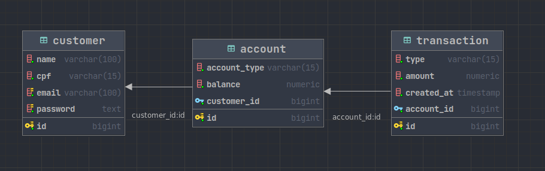

# Digital Account

Este é um projeto de um sistema de contas digitais desenvolvido utilizando o framework Spring Boot e o banco de dados PostgreSQL. O objetivo é fornecer uma solução para gerenciamento de clientes, contas e movimentações (depósitos e saques) em um banco de dados relacional.

## Funcionalidades
O sistema possui as seguintes funcionalidades:

1. Cadastro/Atualização de Conta/Cliente: Permite cadastrar e atualizar informações de clientes e suas contas digitais, incluindo dados pessoais, informações de contato e saldo da conta.

2. Cadastro de Movimentações: Permite registrar movimentações de depósitos e saques nas contas dos clientes, mantendo um histórico de transações.

3. Consulta por Conta/Cliente: Possibilita consultar informações de um cliente específico e suas respectivas contas, incluindo o histórico de movimentações.

4. Consulta por Movimentações de uma Conta: Permite visualizar todas as movimentações realizadas em uma conta específica.

## Tecnologias Utilizadas
- Spring Boot: Framework Java para desenvolvimento de aplicações web e RESTful.
- PostgreSQL: Sistema gerenciador de banco de dados relacional.
- Hibernate: Framework de mapeamento objeto-relacional (ORM) utilizado para interagir com o banco de dados.
- OpenAPI: Todos os endpoints da API estão documentados usando a especificação OpenAPI (anteriormente conhecida como Swagger). A documentação pode ser acessada em /swagger-ui/index.html após a execução do projeto.
## Diagrama Entidade Relacionamento (ER)


O diagrama ER representa a estrutura do banco de dados, mostrando as entidades (tabelas) e seus relacionamentos.

## Modelo Entidade Relacionamento (MER)
O modelo ER está representado no arquivo [modelo_entidade_relacionamento.md](docs/entity-relationship-model.md), detalhando as entidades, atributos e chaves primárias e estrangeiras.

## Scripts DDL e DML
O Flyway é responsável por aplicar automaticamente os scripts [DDL](backend/src/main/resources/db/migration/V1__Create_schema.sql) (Data Definition Language) para criação das tabelas e [DDL](backend/src/main/resources/db/migration/V2__Populate_customer.sql) (Data Manipulation Language) para inserção de dados iniciais. Os scripts estão localizados no diretório 'src/main/resources/db/migration'. O Flyway garante que as mudanças no banco de dados são aplicadas de forma consistente e controlada.

## API
A API foi desenvolvida utilizando o Spring Boot e segue o padrão RESTful para as operações CRUD (Create, Read, Update, Delete).

As rotas disponíveis são:

- GET api/customers: Retorna os dados do cliente autenticado.
- PUT api/customers/: Atualiza os dados do cliente autenticado.
- POST api/customers: Cria um novo cliente no sistema.
- POST api/customers/login: Autentica o cliente no sistema
- GET api/accounts/{id}: Retorna os dados de uma conta específica do cliente autenticado.
- PUT api/accounts/{id}: Atualiza os dados de uma conta existente pertencente ao cliente autenticado.
- GET api/accounts: Retorna todas as contas do cliente autenticado
- POST api/accounts: Cria uma nova conta para o cliente logado cliente.
- GET api/accounts/{id}/transactions: Retorna todas as tranações de uma conta do cliente autenticado.
- POST api/accounts/{id}/transactions: Registra uma nova movimentação (depósito ou saque) em uma conta.


## Executando o Projeto
Para executar o projeto em sua máquina local, siga os seguintes passos:

```bash
# Clone este repositório e todos os submódulos
git clone --recurse-submodules https://github.com/henriquerborba/digital-account.git
# Entre no diretório do repositório
cd digital-account
# Iniciar todos os serviços
docker compose up -d
```
A execução do comando acima gerará todos os seguintes serviços:

- **Digital Account Rest API**: API rest construida a partir de [./backend](./backend/) 
    + Pode ser acessada em http://localhost:8080
    

- [**Postgres**](https://www.postgresql.org): Banco de dados usado pela API
    + Disponível em localhost:5432